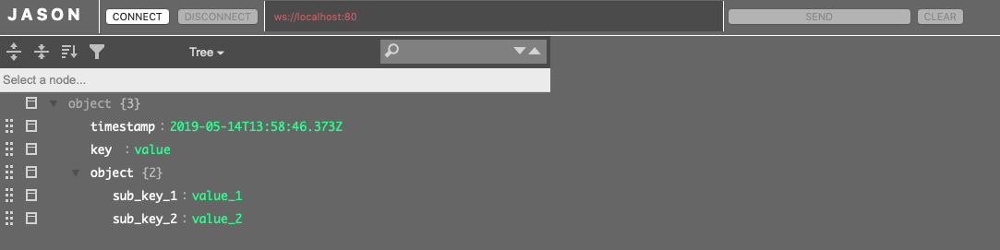

# JASON
__Json+Websocket Communication Interface__

__JASON__ is a simple, web-based tool for creating json objects, sending it via websocket and displaying the response.

Simply open JASON.html in a browser and you are ready to go.

*JASON is using Jos de Jong's jsoneditor: https://github.com/josdejong/jsoneditor*